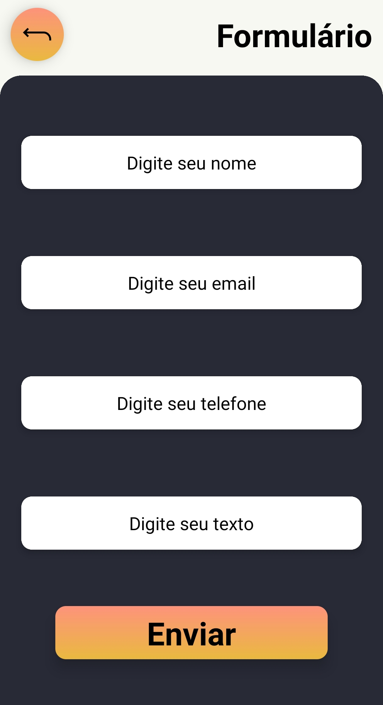
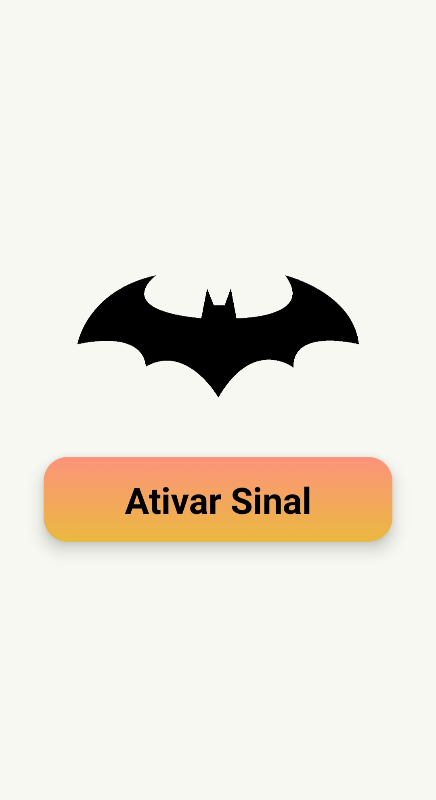

# Projeto React Native Bat Sinal - Desafio DIO

## Sobre o Projeto

Este projeto foi desenvolvido por Matheus Chiodi para o desafio da Digital Innovation One (DIO): "React Native Bat Sinal". O objetivo era criar um bat sinal para o usuario enviar suas informações 

## Funcionalidades

App possiu campos onde o formulario manda informações para o batsinal 

## Tecnologias Utilizadas

- **React Native**: Framework escolhido para o desenvolvimento do aplicativo, garantindo compatibilidade e performance em plataformas iOS e Android.## Capturas de Tela do Projeto

## Capturas de Tela do Projeto

- Formulário:
  

- Tela entrada:
  

## Desenvolvido com ❤ por Matheus Chiodi
